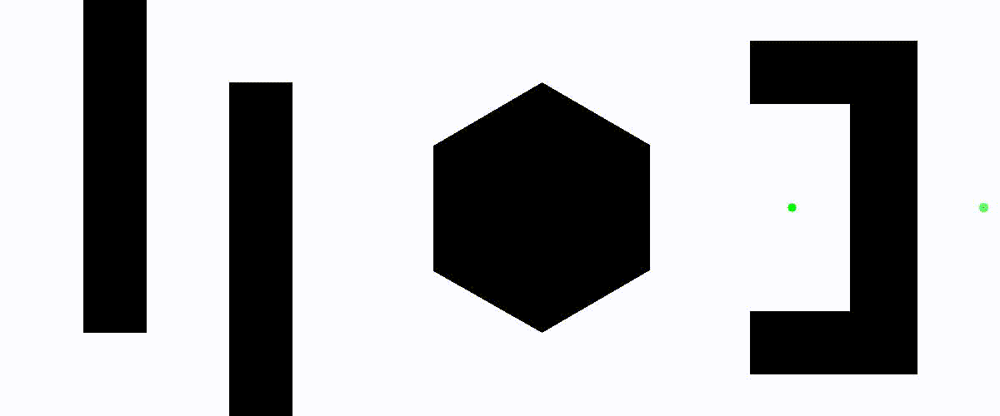

# Dijkstra Path Planner

## Dependencies
- Python 3.6 or higher
- Numpy
- OpenCV 3.4.2 or higher
- time

## Running

```bash
python3 dijkstra_kshitij_karnawat.py
```

The user will be asked to input the start and goal coordinates of the robot. See example below

```bash
Enter x coordinate of start point: 1180
Enter y coordinate of start point: 250
Enter x coordinate of goal point: 950
Enter y coordinate of goal point: 250
```

The code will generate a visualization of the path planning process and the final path. The visualization will be saved as a video in the current directory along with the final path as an image.

## Example Test Cases

The following test cases have been provided for you.

### Test Case 1

```txt
Starting Coordinates = 10, 400

Goal Coordinates = 1180, 10
```


### Test Case 2

```txt
Starting Coordinates = 250, 50

Goal Coordinates = 950, 250
```


### Test Case 3

```txt
Starting Coordinates = 1180, 250

Goal Coordinates = 950, 250
```


